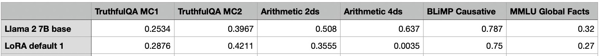

## Challenges or Personal Insights

### General Challenges in LLMs
- Extensive number of _parameters_ (billions to trillions) in foundation models poses _**computational**_ and
_**memory**_ challenges for training.
- To achieve general purpose, LLMs are pre-trained on large scale web-based datasets (trillions of tokens) that poses _**data**_ challenges for training.
- Fine-tuning LLMs on task-specific datasets may make the model _**overfit**_ to task-specific data, and _**collapse**_ to specific domain while lose ability for other domains.

### Pruning Papers' Challenges

In this section, I summarize the limitations for recent LLMs pruning papers to my best understanding. 
If there is any misunderstanding, please [open an issue](https://github.com/liyunqianggyn/LLMs-Pruning-All-In-One/issues) to let me know:) 

#### 1-Bit-LLMs-Approach-2024
- Training from scratch is needed which is expensive.
- Activation may not be easily quantized to 1-bit, which may lead to performance drops.

#### Wanda-Simple-Effective-Pruning-Approach-2024
- In high sparsity level (>60%), it suffers from significant performance drops

#### BESA-Blockwise-Parameter-Efficient-Sparsity-Allocation-2024
- In high sparsity level (>60%), it suffers from significant performance drops
- Straight-Through-Estimator ([STE](https://arxiv.org/abs/1308.3432)) is used to _approximate_ the gradient for learning sparsity ratios,  which may lead to sub-optimal solutions.

#### Sheared-LLaMA-2024

- Computational intensive for pruning stage and retraining stage
- Involve many regularization hyper-parameters, hard to tune

#### Outlier-Weighed-Layerwise-Sparsity-OWL-2024
- In high sparsity level (even in 70%), it suffers from significant performance drops
- Involve some essential hyper-parameters like $M$ and $\lambda$, hard to tune
- Allocate non-uniform sparsity simply by outlier ratios, is a more heuristic solution

#### Plug-and-Play-2024
- In high sparsity level (>60%), it suffers from significant performance drops
- The pruning criteria [_RIA_](concepts/criteria.md) is more heuristic

#### Compresso-2024
- Retraining on small instruction-tuned [Alpaca](https://github.com/gururise/AlpacaDataCleaned) with LoRA, may make _model collapse_ to some specific tasks, while performs bad on other tasks. See [LLM-Pruner](#llm-pruner-nips-2023). 
- Learning sparsity masks with $L_0$ regularization and differentiable re-parameterization  involves many hyper-parameters, hard to use

#### Scaling-laws-sparse-2024
- Would be interesting to see how the scaling law works with efficient-retraining techniques like LoRA 

#### The-LLM-Surgeon-ICLR-2024
- The performance gain is marginal, but the compression runtime is significantly higher (e.g. multi-shot) compared to baseline methods like sparseGPT.
- Investigating high sparsity ratios remains an area of exploration (>60%), which may suffer from significant performance drops

####  SparseGPT-ICML-2023
- In high sparsity level (>60%), it suffers from significant performance drops
- No retraining, but demands computationally intensive weight update process

#### LLM-Pruner-NIPS-2023

 </img>

- Retraining on small instruction-tuned [Alpaca](https://github.com/gururise/AlpacaDataCleaned) with LoRA, may make _model collapse_ to some tasks, while performs bad on other tasks. See above table ([resource](https://lightning.ai/pages/community/lora-insights/)) that the LoRA fine-tuned on Alpaca performs bad at _arithmetic_ tasks.

- One-shot prune +  fine-tuning strategy  lose chances to explore other possible sub-networks.

[//]: # (The capacity of pruned subnetwork by one-shot pruning criteria is the upper bound, no matter how well your fine-tuning strategy is.)

#### Emergence-of-Essential-Sparsity-NIPS-2023
- No much benefit on pruning modern LLMs such as Llama2 where performance drops significantly.