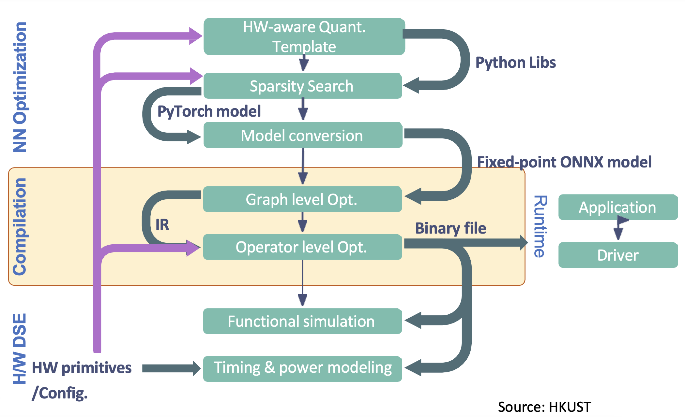

## Budgets

 Budget-aware pruning focuses on
compressing the network subject to the prescribed explicit
resource constraints, including targets in following table. 

| Budgets  | Explanation                                                            |
|----------|------------------------------------------------------------------------|
| `Sparsity` | Percentage of zero weights including layer, block, global network wise | 
| `FLOPs`    | Floating-Point Operations per Second                                   |
| `Latency`  | Execution time on specific hardware                                    | 
| `Energy`   | Power consumption for running  model                                   |
| `Array`    | Structured collection, like memory cells or processors                 |
| `Compiler` | Translates code for computer execution                                 |

For example optimizing the budgets of execution
latency, energy, array or compiler  will involve a
co-optimization between model compression including quantization and pruning, compilation/mapping and
hardware, which offers new opportunities, as shown in following figure.

 </img>
 

