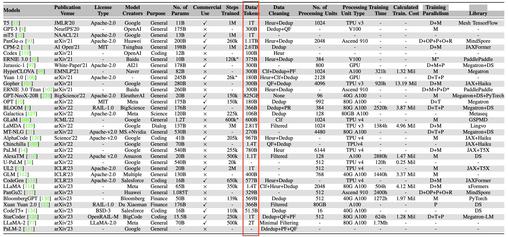
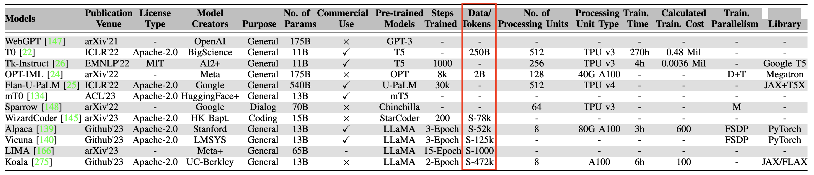

##      Datasets 

###    Datasets in Pruned LLMs
We divided the datasets used in pruning LLMs into six categories based on the size of the datasets. The notion of M $\to$ Million, B $\to$ Billion, T $\to$ Trillion.

| Pruned Datasets | Size in Tokens            | Explanation                                                                                                                                                                                                                                                                                |
|-----------------|---------------------------|--------------------------------------------------------------------------------------------------------------------------------------------------------------------------------------------------------------------------------------------------------------------------------------------|
| `Data-free`     | $0$                       | No input data required, such as simply using [*magnitude*](criteria.md) of weights for pruning.                                                                                                                                                                                            |
| `Calibration`   | $<2\text{M}$              | A limited and small amount of  data. For example, [*SparseGPT*](https://arxiv.org/abs/2301.00774) and [*Wanda*](https://arxiv.org/abs/2306.11695) use a calibration set consisting of $128$ sequences, each comprising $2048$  tokens ($128 \times 2048 \approx 0.26\text{M}$ tokens).     | 
| `Small`         | $2\text{M}-500\text{M}$   | Small datasets can be task-specific datasets, or  instruction-tuned dataset such as [Alpaca](https://github.com/gururise/AlpacaDataCleaned) consists of $50\text{K}$ instruction-response pairs with a median length of $110$ tokens ($50\text{K} \times 110 \approx 5.5\text{M}$ tokens). |
| `Medium-size`   | $500\text{M}-100\text{B}$ | For example, a subset of large pre-trained dataset, such as take $50\text{B}$ from RedPajama.                                                                                                                                                                                              | 
| `Large`         | $100\text{B}-3\text{T}$   | Large pre-trained web-based datasets, for example, Llama2 pre-trained on $2\text{T}$ dataset.                                                                                                                                                                                              |
| `Extra Large`   | $>3\text{T}$              | Extra large datasets.                                                                                                                                                                                                                                                                      |

###    Background of Datasets in Trained LLMs
Now modern LLMs are capable of performing various tasks
like code generation, text generation, tool manipulation, reasoning, and understanding in zero-shot and few-shot settings
in diverse domains, even without requiring any fine-tuning
on downstream tasks. This relies on the pre-training of LLMs on very large-scale datasets, see the [survey](https://arxiv.org/pdf/2307.06435.pdf) for a review. 

* ####   Pre-Training datasets.
In Table 1,  the extensive web-based datasets (_Billions to Trillions_) trained in a self-supervised manner.   

<figcaption>Table1: Pre-trained LLMs(>10B).  “Data/Tokens” is the model’s pre-training data which is either the number of tokens or data size.</figcaption> </img>
 

* ####   Fine-tuning datasets.
See Table 2. There are different styles to fine-tune an
LLM, including transfer learning on _task-specific data_, instruction-tuning incorporating 
_finegrained_ prompts or instructions, and alignment-tuning with _human feedback data_.

<figcaption>Table2: Instruction tuned LLMs(>10B). The used datasets are much smaller than pre-trained datasets.</figcaption> </img>
  

