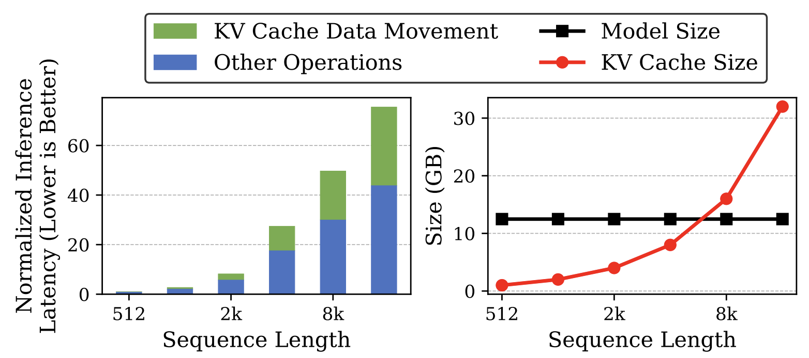

## Key-Value Cache (KV cache) 

Key-Value Cache   ([KV cache](https://arxiv.org/abs/1904.01038))
retains previously computed key-value pairs, eliminating
the need for costly re-computation of these key and value vectors for all previous tokens.

Blog for [KV cache](https://medium.com/@joaolages/kv-caching-explained-276520203249) (In English); A nice visualization of auto-regressive GPT model (In [Chinese](https://github.com/datawhalechina/learn-nlp-with-transformers/blob/main/docs/%E7%AF%87%E7%AB%A02-Transformer%E7%9B%B8%E5%85%B3%E5%8E%9F%E7%90%86/2.4-%E5%9B%BE%E8%A7%A3GPT.md) and [English](https://jalammar.github.io/illustrated-gpt2/)) including  Self-Attention, 
Masked Self-attention with KV cache. 

However, 
accessing the KV cache from off-chip memory during token
generation introduces additional memory latencies and is
constrained by memory bandwidth limitations, leading to scalability challenges.
Take an example, in following figure by [Keyformer](https://arxiv.org/abs/2403.09054), increasing
the sequence length by 16× (from 512 to 8K) results in more than 50× increase in inference latency, and approximately 40% of the total inference time (highlighted
in green) is consumed by KV cache data movement, and also KV cache size surpasses the
model size when the sequence length exceeds 8K (right sub-figure). 

 </img>
 

