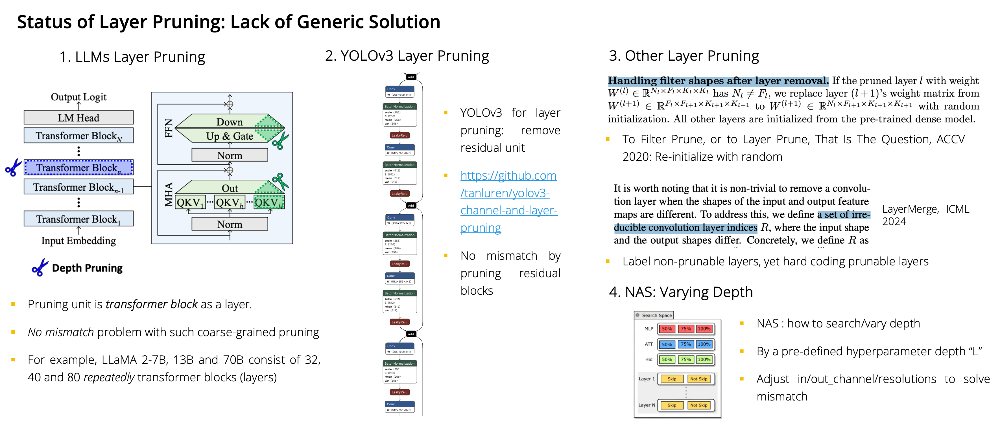

##  Useful Concepts  

### Outliers in LLMs

One  intriguing trait of LLMs is the exhibition of outlier features, which are the features with significantly
larger magnitudes than others. The paper of [OWL](https://arxiv.org/abs/2310.05175) claims to preserve outlier features.
Recent paper [Quantizable Transformer](https://arxiv.org/abs/2306.12929) finds that the outliers are related to softmax function in attention. See [blog](https://www.evanmiller.org/attention-is-off-by-one.html) for more details.

### Scaling laws
Increasing
model size or data brings _consistent_ performance improvements, even at very large scale. And this scaling behavior can be predictable by simple [power-law](https://arxiv.org/abs/2001.08361) curves. 

### Layer or Depth pruning
Layer pruning is a technique to remove entire layers from the model. It is a coarse-grained pruning method, which may be very effective in some cases.

- Dimensional Mismatch Problem:  When pruning intermediate layers, the input and output dimensions of subsequent layers may no longer match. 
- Current LLMs Layer Pruning: Transformer blocks have the exactly same dimension of input  and output due to the residual connection. Thus, layer pruning is feasible for LLMs.
 Did not suit for situation when mismatch between new input and old input, such as VGG layer pruning.

<figcaption></figcaption> </img>
 

In contrast, width pruning is a fine-grained pruning method, which removes channels or neurons from each layer.