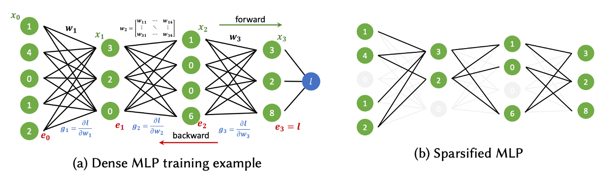
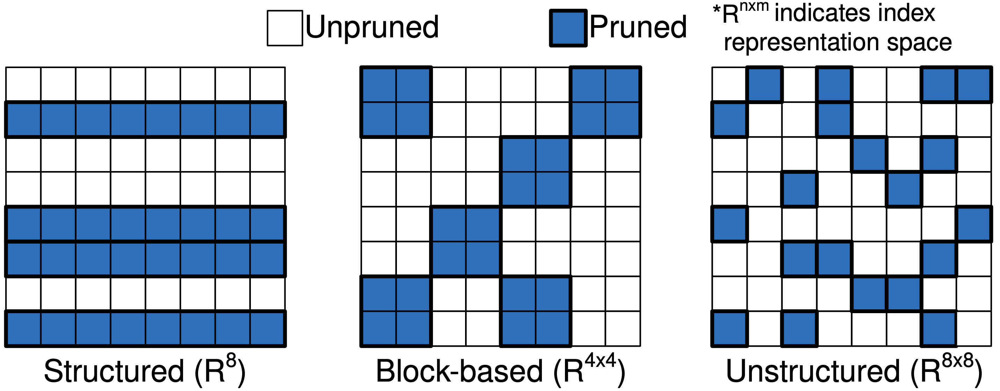
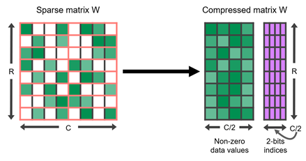
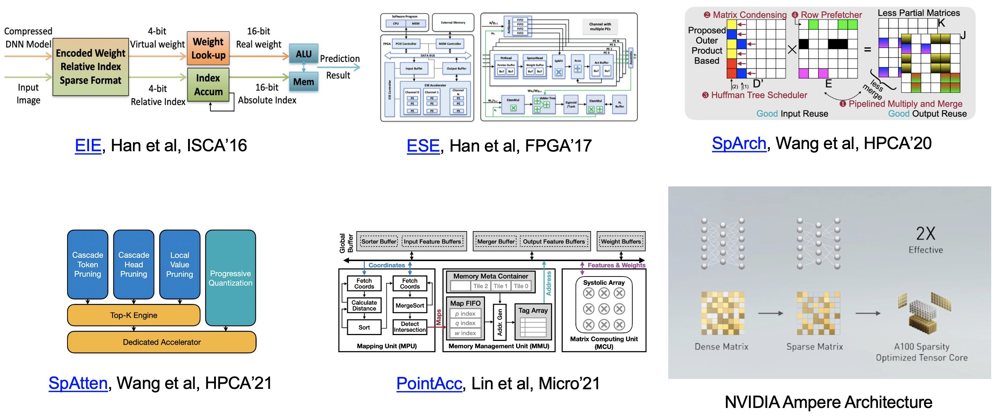

## Different Pruning Granularity

[//]: # (
 </img>
)

Network pruning 
is a technique for reducing the size and complexity of a machine learning model by removing unnecessary or redundant parts to reduce the memory footprint, improve training or inference speed, and reduce power consumption, with negligible accuracy loss. Pruning methods can be subdivided into
methods that promote _unstructured, structured, or semi-structured _i.e._ blocked_ sparsity,
see the [survey](https://arxiv.org/abs/2102.00554) for a review.

 </img>
 

### Unstructured

Unstructured pruning also termed as weight pruning removes individual weights from the network.
Such non-structured methods lead to _irregular, sparse_ weight matrices (see right sub-figure of above figure, arbitrary weight can be pruned).
This adds
overheads for index structures and leads to less efficient execution on hardware that is optimized
for dense computations. However, Unstructured pruning “is very fine-grained and makes pruning
particularly powerful.” 
Thus, [inference engines](Hardware Support for Sparsity) have
been developed to bring weight sparsity to AI accelerators.

[//]: # (As a result, they are less compatible with the data parallel execution model in GPUs and multicore CPUs)

### Structured

 Filter pruning is a form of structured
sparsity by removing entire filters from the network’s layers. Filter pruning often achieves practical network
compression and significant acceleration as entire feature
maps are no longer computed. 
### Semi-structured 
Semi-structured pruning removes weights in block-wise from the network.
For example, the NVIDIA A100 GPU adds support for fine-grained structured sparsity, i.e., semi-structured to its Tensor Cores. 
Sparse Tensor Cores accelerate a $2:4$ sparsity pattern. In each contiguous block of four values, _two values must be zero_. This naturally leads to a sparsity of $50$%, which is fine-grained. There are no vector or block structures pruned together. Such a regular pattern is easy to compress and has a low metadata overhead 
as seen in following figure.

 </img>
 

### Hardware Support for Sparsity
Following figure shows some popular inference Engines that bring weight sparsity to AI accelerators.

 </img>
 

